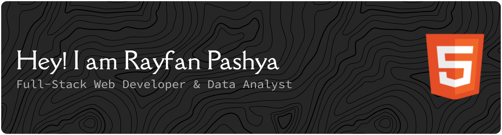

  

  

 

  

  
  
  

 

<table width="100%" align="center" style="border: none; background-color: transparent;">
  <tr style="border: none;">
    <td width="55%" valign="top" style="border: none;">
      <h2>⚡ Tentang Saya</h2>
      

        Saya adalah mahasiswa <b>Sistem Informasi</b> di Telkom University yang memandang kode sebagai instrumen untuk memecahkan masalah. Pendekatan saya berfokus pada merancang arsitektur perangkat lunak yang <i>scalable, efisien</i>, dan berdampak nyata pada kelancaran ekosistem bisnis.
      

      <ul>
        <li>🌱 <b>Fokus Akselerasi:</b> Memperdalam pemahaman arsitektur <b>Microservices</b> (<b>gRPC</b> & <b>WebSockets</b>), serta optimasi berkelanjutan pada ekosistem <b>Next.js</b> dan <b>Laravel</b>.</li>
        <li>📊 <b>Perspektif Ekstra:</b> Pengalaman praktis di ranah <b>Data Analytics</b> dan <b>Strategic Marketing</b> memberikan sudut pandang komersial yang solid untuk setiap produk yang saya kembangkan.</li>
        <li>🎬 <b>Fakta Unik:</b> Sebagai pemenang <i>Juara 1 Lomba Film Pendek 2024</i>, saya percaya bahwa barisan kode yang elegan bekerja layaknya sebuah film—keduanya harus merangkai narasi dan arsitektur yang intuitif bagi sang audiens.</li>
      </ul>
    </td>
    <td width="45%" align="center" valign="middle" style="border: none;">
      
    </td>
  </tr>
</table>

---

### 🛠️ Tech Stack & Arsenal

  <i>Bahan bakar di balik setiap baris kode, arsitektur, dan infrastruktur proyek yang saya bangun.</i>

  
<b>✨ Frontend & Craftsmanship</b>

  
    
  
<b>⚙️ Backend & Architecture</b>

  
    
  
<b>🔧 Tooling & Infrastructure</b>

  

---

<table width="100%" align="center" style="border: none; background-color: transparent;">
  <tr style="border: none;">
    <td width="50%" valign="top" style="border: none;">
      <h3>💼 Perjalanan Profesional</h3>
      <ul>
        <li>
          <b>Marketing Data Administrator</b>  
          <i>@ Marketing Crew Tel-U</i>  
          
📈 Terlibat aktif dalam menganalisis berbagai matriks tren segmentasi pasar untuk mendorong optimasi performa dan eskalasi strategi bisnis yang efektif.

        </li>
        <li>
          <b>Assistant Director Intern</b>  
          <i>@ CV. ADI KREASINDO</i>  
          
👔 Mengawasi dan mengorkestrasi alur operasional internal tim, sembari berkolaborasi intensif dalam siklus manajemen proyek operasional bisnis secara <i>end-to-end</i>.

        </li>
        <li>
          <b>Video Editor & Content Creator</b>  
          <i>@ PT. SARI TEKNOLOGI</i>  
          
🎥 Secara konsisten mentranslasikan narasi hingga gagasan teknis yang kompleks menjadi sebuah balutan visual serta multimedia informatif dan dinamis.

        </li>
      </ul>
    </td>
    <td width="50%" valign="top" style="border: none;">
      <h3>🚀 Proyek Spektakuler</h3>
      <ul>
        <li>
          <b>GamerZone</b>  
          
🎮 Platform <i>Top-Up</i> industri <i>gaming</i> dengan prospek skalabilitas riil; memadukan kekuatan arsitektur <i>Microservices</i> dengan pengalaman antarmuka ruang maya 3D modern secara mulus.

        </li>
        <li>
          <b>Online Photocopy</b>  
          
🖨️ Mendigitalisasikan proses pencetakan konvensional menjadi layanan modern terintegrasi; membawa komunikasi siklus data riil (<i>real-time</i>) dengan mengandalkan efisiensi tinggi <i>WebSockets</i> dan ketangguhan perantara layanan <i>gRPC</i>.

        </li>
        <li>
          <b>ScanEatz</b>  
          
🏢 Sebuah Sistem <i>Full-Stack</i> terpadu operasional UMKM lintas sektor komprehensif, ditopang penuh oleh kapabilitas manajemen logistik intuitif dan pelacak lokasi (pemindai geolokasi terkostumisasi).

        </li>
      </ul>
    </td>
  </tr>
</table>

---

### 📊 GitHub Metrics & Eksposure Repositori

  

 

  
  

 

  

 

  
<i>Secangkir kopi hangat mendampingi barisan kode yang tertata rapi. Mari <a href="mailto:pashyarayfan@gmail.com">berbincang dan berkolaborasi!</a></i>

